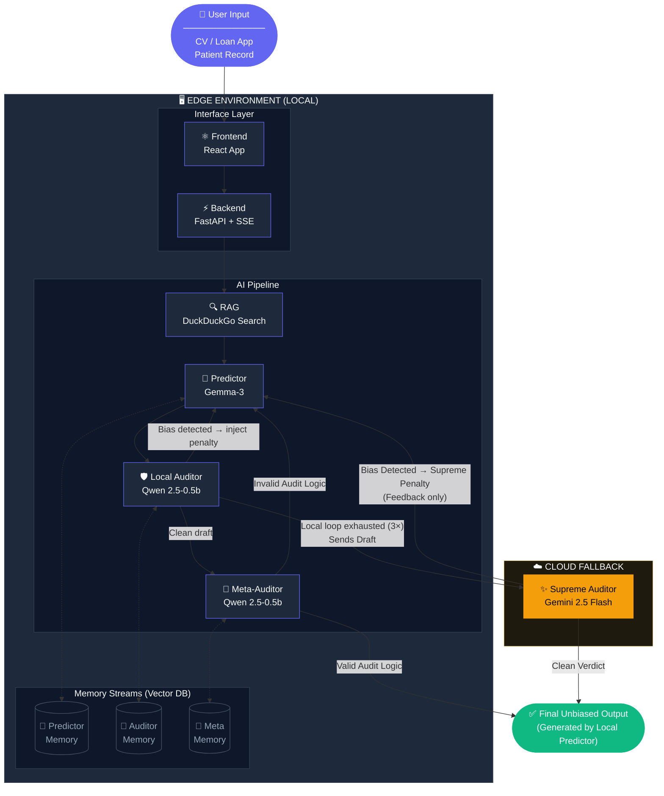

# BiasModel v2.5 — Unbiased AI Decision Pipeline

A full-stack AI system that detects and eliminates bias in automated decisions across **Job Selection**, **Loan Provision**, and **Medical Care** — using an adversarial multi-auditor loop with local + cloud AI.

> 🏆 Built for **Hack2Skill × Google for Developers** — PromptWars Challenge

---

## 🧠 Architecture



**Pipeline flow:**
1. **RAG** — DuckDuckGo fetches real-world fairness context for the domain
2. **Predictor** — Gemma-3 generates the initial decision/recommendation
3. **Local Auditor** — Gemma-3 checks for bias; if found → injects penalty and loops back (max 3×)
4. **Meta-Auditor** — verifies the auditor's own logic isn't flawed *(can be disabled for Speed Mode)*
5. **Supreme Auditor** — Gemini 2.5 Flash fires only if all local retries fail

Each domain auto-injects its own **system prompt**, **sensitive attribute list**, and **evaluation criteria**.

---

## 🌐 Analysis Domains

| Domain | Input Type | Key Sensitive Attributes |
|--------|-----------|--------------------------|
| **Job Selection** | CV / Resume text | Gender, Race, Age, Employment Gap, Institution |
| **Loan Provision** | Financial profile / application | Race, Gender, Marital Status, Nationality, Zip Code |
| **Medical Care** | Patient data / symptoms / records | Race, Gender, Age, Insurance Type, Socioeconomic Status |

---

## ⚙️ Tech Stack

| Layer | Technology |
|-------|-----------|
| **Backend** | FastAPI (Python) + Server-Sent Events for real-time streaming |
| **Frontend** | React 19 + Vite + Framer Motion |
| **Local AI (Predictor + Auditors)** | Jan AI → Gemma-3-4B Thinking model |
| **Cloud AI (Supreme Auditor)** | Gemini 2.5 Flash (Google Generative AI) |
| **RAG** | DuckDuckGo Search (`ddgs`) + Google CSE fallback |
| **File Parsing** | `pdfplumber` (PDF), `python-docx` (DOCX), UTF-8 (TXT) |

---

## 🚀 Setup & Running

### 1. Prerequisites
- Python 3.10+
- Node.js 18+ and npm — [nodejs.org](https://nodejs.org)
- [Jan AI](https://jan.ai/) installed with the **Gemma-3-4B Thinking** model loaded

### 2. Clone the repo
```bash
git clone https://github.com/SayanSantra-t/unbaised_AI.git
cd unbaised_AI
```

### 3. Backend — Python setup
```bash
# Create virtual environment (not committed — do this locally)
python -m venv venv

# Activate it
.\venv\Scripts\activate       # Windows
source venv/bin/activate      # Mac / Linux

# Install all dependencies
pip install -r requirements.txt
```

### 4. Frontend — Node setup
```bash
# node_modules is not committed — install locally
cd frontend
npm install
cd ..
```

### 5. Environment variables
```bash
cp .env.example .env
```
Open `.env` and fill in:
```env
GEMINI_API_KEY=your_gemini_api_key_here
GOOGLE_CSE_ID=your_google_cse_id_here    # optional — DuckDuckGo is the default RAG
```
Get a Gemini API key free at: https://aistudio.google.com/app/apikey

### 6. Start Jan AI
- Open the Jan AI desktop app
- Load **Gemma-3-4B** (or the Thinking variant)
- Enable the **Local API Server** at `http://127.0.0.1:1337`

### 7. Launch the app

**Windows (one click — auto setup + launch):**
```bash
run.bat
```

**Manual (two terminals):**
```bash
# Terminal 1 — Backend API (port 8000)
python main.py

# Terminal 2 — Frontend dev server (port 5173)
cd frontend
npm run dev
```

Then open **http://localhost:5173** 🎉

---

## 📁 Project Structure

```....
unbaised_AI/
├── main.py                    # FastAPI backend — pipeline, /process, /extract-cvs
├── requirements.txt           # Python dependencies
├── .env.example               # Environment variable template (copy → .env)
├── start.bat                  # One-click Windows launcher
├── ARCHITECTURAL_OVERVIEW.txt # Detailed pipeline architecture notes
│
└── frontend/
    ├── src/
    │   ├── App.jsx            # Main React app — Manual + Batch modes, domain selector
    │   ├── App.css            # All styles
    │   ├── main.jsx
    │   └── assets/
    ├── public/
    ├── package.json
    └── vite.config.js
```

> ⚠️ `venv/` and `frontend/node_modules/` are **not committed to git**.
> Run steps 3 and 4 to recreate them on your machine.

---

## ✨ Features

### Manual Mode
- Select a domain (Job / Loan / Medical) — auto-fills prompt, criteria, attributes
- Paste input data and run through the full pipeline
- Live log console: every step streamed in real-time via SSE
- Penalty loop — retries up to 3× injecting the bias reason back into the prompt
- Expandable **AI System Prompt** editor per domain
- Supreme Auditor (Gemini 2.5 Flash) fires automatically if local loop fails
- **Meta-Auditor toggle** — disable for Speed Mode (auto-warned at 10+ files)

### Batch Mode
| Domain | Tab Label | What you upload |
|--------|-----------|-----------------|
| Job Selection | Batch CVs | Resumes in PDF / DOCX / TXT |
| Loan Provision | Batch Applications | Loan application files |
| Medical Care | Batch Records | Patient record files |

- Drag-and-drop multi-file upload with **duplicate detection**
- Text extracted server-side: `pdfplumber` → PDF, `python-docx` → DOCX
- Files processed **sequentially** so local GPU isn't overwhelmed
- CVs auto-removed from queue once processed
- Results split into **Selected / Not Selected / Needs Review** sections
- **Export** accepted or rejected lists as `.txt` files
- **👁 Workflow view** — see full pipeline logs per CV in a modal
- **Speed Mode** toggle — skip Meta-Auditor for large batches (warned at 10+ files)

---

## 🔑 API Reference

| Method | Endpoint | Description |
|--------|----------|-------------|
| `GET` | `/process` | SSE stream — runs full bias detection pipeline |
| `POST` | `/extract-cvs` | Upload files, returns `[{ filename, text }]` |

**`GET /process` query parameters:**
```
input_data       Text to evaluate
task_type        e.g. "Job Selection (CV Analysis)"
sensitive_attrs  e.g. "Gender, Race, Age"
criteria         Evaluation criteria for this domain
system_prompt    Domain-specific AI instruction (auto-set by frontend)
```

---

## 👥 Team

| Name | Role |
|------|------|
| Sayan Santra | AI Pipeline Architecture / Backend |
| Mohit Agarwal | Frontend / Batch File Upload / Multi-Domain UI |
| Ayan Mandal | Software Testing / Optimization  |
| Srijan Maity | RAG implementation / Agent Memory  |

---

## 📄 License

MIT — feel free to fork and build on this.
